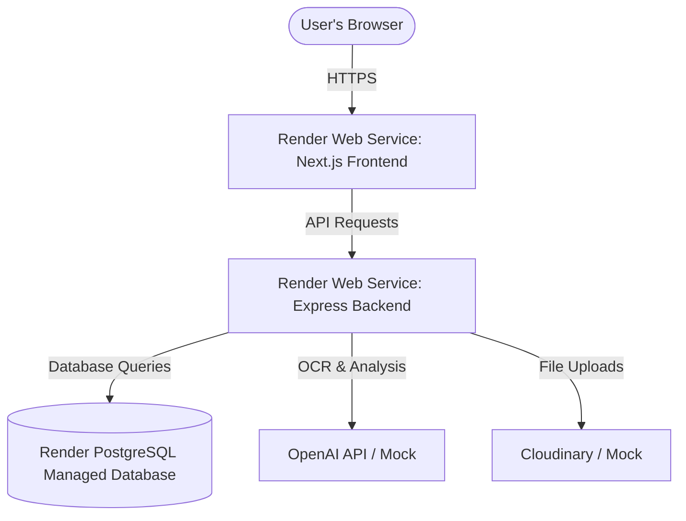

# Deployment Guide: Hosting MedLeave Portal on Render

This guide walks you through the step-by-step process of deploying the **MedLeave Portal** on Render. Since this is a monorepo consisting of a Node.js/Express backend and a Next.js frontend, we will host them as separate, interconnected services.

---

## Architecture Overview



To host the complete portal, you will set up **three resources** on Render:
1. **Render PostgreSQL**: A managed database service.
2. **Backend Web Service**: A Node.js web service running the Express API.
3. **Frontend Web Service**: A Node.js web service running the Next.js frontend.

---

## Step 1: Push Changes to GitHub

I have already updated your database configuration to use PostgreSQL and removed the SQLite-specific migration files. 
Commit and push these changes to your GitHub repository:

```bash
git add .
git commit -m "Configure database for PostgreSQL and Render deployment"
git push origin main
```

---

## Step 2: Set Up Render PostgreSQL

1. Log in to your [Render Dashboard](https://dashboard.render.com/).
2. Click **New** (top right) and select **PostgreSQL**.
3. Configure the database details:
   - **Name**: `medleave-db`
   - **Database Name**: `medleave`
   - **User**: (leave default or set custom)
   - **Region**: Choose the region closest to your users.
   - **Instance Type**: Select **Free** (or your preferred tier).
4. Click **Create Database**.
5. Once created, copy the **Internal Database URL** (we will use this for the backend service).

---

## Step 3: Deploy the Express Backend

Deploy the Express backend as a **Web Service** on Render.

1. Click **New** -> **Web Service**.
2. Connect your GitHub repository.
3. Configure the service:
   - **Name**: `medleave-backend`
   - **Region**: (Same region as your database)
   - **Branch**: `main` (or your active branch)
   - **Root Directory**: `backend` (This points Render directly to your backend folder)
   - **Runtime**: `Node`
4. Set the build and start commands:
   - **Build Command**: 
     ```bash
     npm install && npx prisma generate && npm run build
     ```
   - **Start Command**: 
     ```bash
     npx prisma db push && npm start
     ```
     *(Note: `npx prisma db push` is used since we removed the SQLite migrations. It will automatically create the PostgreSQL tables based on the updated schema file.)*

### Environment Variables
Click **Advanced** or navigate to **Environment** in the sidebar, and add the following keys:

| Key | Value | Description |
| :--- | :--- | :--- |
| `DATABASE_URL` | *[Paste your Internal Database URL here]* | The connection string copied from Step 2. |
| `PORT` | `10000` | Render's default port. |
| `NODE_ENV` | `production` | Enables production mode. |
| `JWT_SECRET` | *[Create a random secret string]* | Secret key for signing authorization tokens. |
| `JWT_EXPIRES_IN` | `7d` | Expiration limit for user tokens. |
| `OPENAI_API_KEY` | `mock` or *[Your actual OpenAI API Key]* | Use `mock` to run without API charges, or enter your key for real vision OCR. |
| `CLOUDINARY_CLOUD_NAME` | `mock` or *[Your Cloudinary Cloud Name]* | Use `mock` to save uploads locally (ephemeral), or provide details for persistent cloud storage. |
| `CLOUDINARY_API_KEY` | `mock` or *[Your Cloudinary API Key]* | Cloudinary auth key (required if name is not `mock`). |
| `CLOUDINARY_API_SECRET`| `mock` or *[Your Cloudinary API Secret]*| Cloudinary private secret (required if name is not `mock`). |

5. Click **Create Web Service**.
6. Once deployed, note down the backend's public URL (e.g., `https://medleave-backend.onrender.com`).

### Seeding the Database
To populate the database with initial timetable data and test accounts (e.g., `student@juit.ac.in`, `doctor@juit.ac.in`), run the seed script from Render:
1. Go to your `medleave-backend` service page on Render.
2. Click **Shell** in the left sidebar.
3. Run the following command:
   ```bash
   npx prisma db seed
   ```

---

## Step 4: Deploy the Next.js Frontend

Next.js 15 apps containing dynamic routing and client-side page transitions are deployed as a Node-based **Web Service**.

1. Click **New** -> **Web Service**.
2. Connect the same GitHub repository.
3. Configure the service:
   - **Name**: `medleave-frontend`
   - **Region**: (Same region as the backend)
   - **Branch**: `main` (or your active branch)
   - **Root Directory**: `frontend`
   - **Runtime**: `Node`
4. Set the build and start commands:
   - **Build Command**: 
     ```bash
     npm install && npm run build
     ```
   - **Start Command**: 
     ```bash
     npm start
     ```

### Environment Variables
Navigate to the **Environment** tab and add the following keys:

| Key | Value | Description |
| :--- | :--- | :--- |
| `NEXT_PUBLIC_API_URL` | `https://medleave-backend.onrender.com/api` | **CRITICAL**: The URL of your deployed backend (replace with your actual backend URL). |
| `NODE_ENV` | `production` | Optimized production bundle. |

5. Click **Create Web Service**.
6. Once deployed, Render will provide a public URL for your frontend (e.g., `https://medleave-frontend.onrender.com`). You can visit this URL to access the MedLeave Portal!
